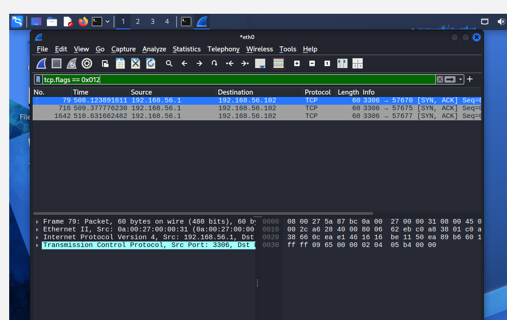

# 🛡️ Advanced Network Traffic Monitoring & Security Analysis Lab

## 📌 Project Overview
This project documents the design and execution of an isolated network security lab built within Oracle VirtualBox. I engineered a Host-Only virtual network topology to safely monitor, capture, and forensically analyze live adversarial traffic flows between a Kali Linux attack node and a target gateway system.

---

## 🔬 Lab Diary & Analysis Scenarios

### Section 1: Baseline Traffic & Advanced Reconnaissance Detection (Task 1)

#### Detecting an Active Port Scan Attack
I simulated an aggressive Nmap SYN Stealth Scan against the target gateway. Wireshark registered a massive, rapid-fire flood of incoming `[SYN]` packets targeting dozens of random destination ports within milliseconds. 

When the scanning utility hit closed ports, the target gateway actively responded with **`[RST]` (Reset)** flags to terminate the connection attempts, mapping out the unavailable infrastructure:


#### Forensic Findings (The Intrusion Signature)
To isolate the critical data from the scanning noise, I utilized the Boolean hexadecimal filter `tcp.flags == 0x012`. This precisely filtered for all **`[SYN, ACK]`** responses, definitively confirming that the target system was exposed and listening on **Port 3306 (MySQL)**.



This visual data flow confirms that after filtering out ordinary noise, the target system admitted Port 3306 was open, providing an actionable attack vector.

---

### Section 2: Cleartext Credential Harvesting (Task 2)

#### The Interface Diagnostic Challenge (The Empty Capture)
Before jumping to a successful capture, I ran a critical validation check. While sending unencrypted HTTP login POST requests, I monitored the standard host network interface (`eth0`). 

By applying the display filter `http.request.method == "POST"`, the packet list remained entirely blank. This diagnostic test proved an important architectural fact: localized, internal loopback traffic stays completely isolated from external physical/virtual network adapters.


#### The Loopback Pivot & Exploitation Proof
To intercept the localized credentials, I shifted the monitoring capture to the internal **Loopback interface (`lo`)**. 

By applying the display filter `http.request.method == "POST"` on the loopback interface and selecting **Follow HTTP Stream**, I successfully reconstructed the plaintext conversation body, exposing the active credentials entirely unencrypted:

```text
user=admin&pass=Secret123
